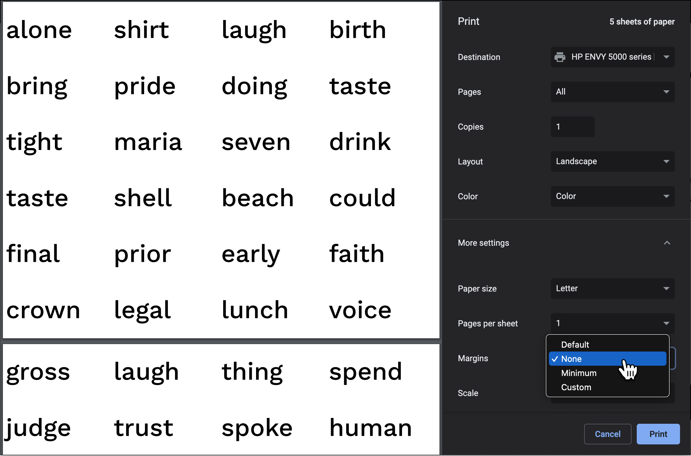

# wordpages

Make a bunch of pages with words on them

## About this project

My partner is a Speech Language Pathologist (SLP) and she needed a way to easily make a large number of words appear on a printed page - as evenly spaced as possible.

With CSS grid and some magic numbers, this tool does exactly that!



## Developing

Once you've created a project and installed dependencies with `npm install` (or `pnpm install` or `yarn`), start a development server:

```bash
npm run dev

# or start the server and open the app in a new browser tab
npm run dev -- --open
```

## Building

To create a production version of your app:

```bash
npm run build
```

You can preview the production build with `npm run preview`.

> This app is deployed on Netlify at: [wordpages.netlify.app](https://wordpages.netlify.app/)
